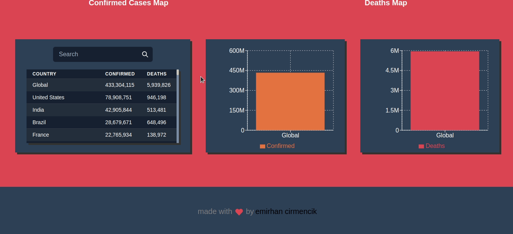

# Covid 19 Tracker App

[Live](https://covidtrackerec.netlify.app)

## Getting Started with Create React App

This project was bootstrapped with [Create React App](https://github.com/facebook/create-react-app).

## Available Scripts

In the project directory, you can run:

### `npm start`

Runs the app in the development mode.\
Open [http://localhost:3000](http://localhost:3000) to view it in your browser.

The page will reload when you make changes.\
You may also see any lint errors in the console.

## Api

[Api](https://github.com/mathdroid/covid-19-api)

## Maps

[SvgMap](https://github.com/StephanWagner/svgMap)

## Charts

[Recharts](https://github.com/recharts/recharts)
